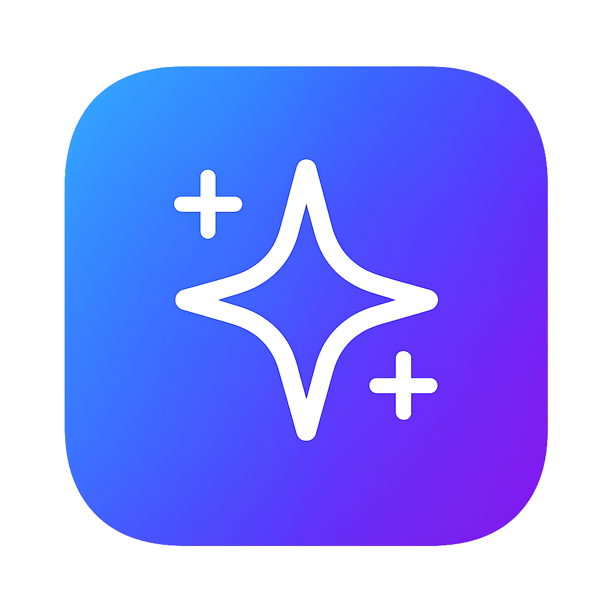

  

<h1 align="center">Hunt Studio</h1>

<i>AI-Powered Product Discovery Platform for the Modern Era</i>

  
  
  
  

## 🌟 Overview
Hunt Studio is a modern reimagining of product discovery platforms, designed to address the fundamental challenges facing Product Hunt in 2025. Built with AI-powered personalization and community-driven curation, it provides a streamlined platform for discovering innovative products and technologies.

The platform features intelligent product recommendations, multiple viewing modes (grid/list), real-time voting capabilities, and an intuitive user interface that makes product discovery engaging and efficient. Whether you're a maker looking to showcase your product or a tech enthusiast discovering the latest innovations, Hunt Studio provides the tools you need.

**🎯 Problem Solved**: Traditional product discovery platforms suffer from poor curation (only 10% of submissions get featured), bot manipulation, and limited personalization. Hunt Studio leverages AI to provide personalized product recommendations, ensures quality through community-driven validation, and offers a modern, responsive interface that works seamlessly across all devices.

**Key Benefits**:

🤖 **AI-Powered Recommendations** - Smart algorithms show you products matched to your interests

🎯 **Personalized Discovery** - Each product displays relevance scores based on your preferences

📱 **Flexible Viewing** - Switch between grid and list views for optimal browsing experience

⭐ **Community Voting** - Engage with products through an intuitive voting system

🚀 **Modern Interface** - Clean, responsive design with smooth animations and interactions

🔍 **Advanced Filtering** - Find exactly what you're looking for with powerful search and sort options

Perfect for product makers launching new innovations, investors scouting emerging technologies, early adopters discovering cutting-edge tools, or anyone passionate about the future of technology and innovation.

## 🚀 Live Demo
Visit [Hunt Studio](https://huntstudio.vercel.app/) to experience the platform in action.

## 📱 Features
- Responsive design optimized for all devices
- AI-powered product personalization
- Grid and list view modes with persistent preferences
- Real-time voting and engagement
- Advanced product filtering and sorting
- Smooth animations and modern UI components

---
**⚠️ Note**: This is currently a Platform prototype only. Full AI functionality, backend integration, and proper data persistence will be added in future iterations.
